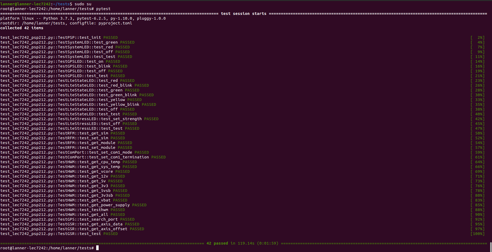

# Python API for Lanner-PSP test

[Lanner PSP](https://iot.lannerinc.com/psp/PSP_Summary.htm) 可用來存取 Lanner IPC 上的各種 IO、控制燈號、讀取內部各種 Sensor 資訊等等。

[Python API for Lanner-PSP](https://github.com/jrchen982/lannerpsp-python) is base on [Lanner PSP](https://iot.lannerinc.com/psp/PSP_Summary.htm)，是為了讓客戶與開發人員能更方便的調用 PSP 而開發的 Python library。可用的功能都寫在 [Usage](https://github.com/jrchen982/lannerpsp-python#usage) 裡面了，功能有限，但足以應付目前 CM 專案的需求。

> For the hardware part, please refer to the user manual of each model on [Lanner's official website](https://lannerinc.com/) for comparison.

## Requirements

### Network

Please keep the external network unblocked in order to install the required modules.

### ROOT privileges

The installation and operation of PSP requires **root** privileges.

### Core SDKs

首先需要安裝 [PSP](https://iot.lannerinc.com/psp/PSP_Summary.htm)，如果是已經很熟悉 PSP 安裝步驟的測試人員，可以略過這個步驟，但強烈建議你按照我的方式[**一條指令裝到好**](https://github.com/jrchen982/lannerpsp#installation)，省時省力好辦事:

```shell
curl -sSL https://iot.lannerinc.com/psp | bash -s [product-type] [version-name]
```

Example for LEC-7242 with PSP 2.1.2:

```shell
curl -sSL https://iot.lannerinc.com/psp | bash -s LEC-7242 2.1.2
```

### Python 3.6+

The [Python](https://www.python.org/) version needs to be >=3.6, you can check the Python version through the terminal:

```shell
python3 -V
```

Install [pip](https://zh.wikipedia.org/zh-tw/Pip_(%E8%BB%9F%E4%BB%B6%E5%8C%85%E7%AE%A1%E7%90%86%E7%B3%BB%E7%B5%B1)) (Python software package management system):

```shell
sudo apt update && sudo apt install python3-pip
```

Install [lannerpsp-python](https://github.com/jrchen982/lannerpsp-python) module via [pip](https://zh.wikipedia.org/zh-tw/Pip_(%E8%BB%9F%E4%BB%B6%E5%8C%85%E7%AE%A1%E7%90%86%E7%B3%BB%E7%B5%B1)):

```shell
sudo pip3 install lannerpsp
```

## Pytest

Pytest 是 Python 的一種易用、高效和靈活的單元測試框架，可以支援單元測試和功能測試，這邊簡單示範一下我個人測試時的範例。

### Setup

首先要安裝 `pytest` 模組:

```shell
sudo pip3 install pytest
```

接著把 **tests** 資料夾丟到要測試的機器內 (可以用 SFTP 之類的方式)。

### Run

在要測試的機器內執行 (記得使用 **root** 身分操作):

```shell
pytest tests/test_[product-type]_psp[version-name].py
```

Example for LEC-7242 with PSP 2.1.2:

```shell
pytest tests/test_lec7242_psp212.py
```

`pytest` 將會自動執行腳本內的所有測試項目，並在 terminal 上打印出有多少個 pass 跟有多少個 fail，如圖所示:



執行完之後記得重開機讓機器回到 default 值，以確保後續操作不會發生什麼奇怪問題:

```shell
sudo reboot
```

## Coding

如果是熟悉 Python 的測試人員，可以使用 Python [IDLE](https://en.wikipedia.org/wiki/IDLE) 逐行進行測試，或是自己編寫測試腳本。

### Setup

進入 Python3 [IDLE](https://en.wikipedia.org/wiki/IDLE) (記得使用 **root** 身分操作):

```console
lanner@lanner-lec7242:~$ sudo python3
Python 3.7.3 (default, Jan 22 2021, 20:04:44)
[GCC 8.3.0] on linux
Type "help", "copyright", "credits" or "license" for more information.
>>>
```

接著就可以在 [IDLE](https://en.wikipedia.org/wiki/IDLE) 輸入各種 Python 指令，要退出 [IDLE](https://en.wikipedia.org/wiki/IDLE) 可以輸入 `exit()`、`quit()` 或是直接 `Ctrl-D`。

### Import

在呼叫 PSP 做事情之前，需先 import 對應的 Python class，當只需要使用特定 class 時，直接 import 該 class 即可，比如:

```python
from lannerpsp import SystemLED
```

當需要使用多個 class 時，需以逗點分隔每個 class，比如:

```python
from lannerpsp import SystemLED, HWM, RFM
```

如果懶得一個個寫，可以一次 import 全部，比如:

```python
from lannerpsp import *
```

### Instantiate

class 需要實例化為物件才能使用，在實例化時可以傳入兩個參數，第一個參數是 `liblmbio.so` 的路徑 (預設: `/opt/lanner/psp/bin/amd64/lib/liblmbio.so`)，第二個參數是 `liblmbapi.so` 的路徑 (預設: `/opt/lanner/psp/bin/amd64/lib/liblmbapi.so`)。

如果前面有按照我的方式[**一條指令裝到好**](https://github.com/jrchen982/lannerpsp#installation)，就不需要特別指定路徑，保持空白即可，比如:

```python
from lannerpsp import HWM
hwm = HWM()
```

如果是自行安裝，或是安裝後把 `.so` 檔移到別的路徑，則需分別指定路徑，比如:

```python
from lannerpsp import HWM
hwm = HWM(
    lmb_io_path="/psp/bin/amd64/lib/liblmbio.so",
    lmb_api_path="/psp/bin/amd64/lib/liblmbapi.so",
)
```

而 `ComPort` 比較特別，因為當初 PSP team 開發時沒有把它包在 PSP 本體內，而是為了 LEC-7242 另外開發的，所以實例化的方式不太一樣。`ComPort` 實例化時的傳入參數為 `config_tool` 二進制文件的路徑 (預設: `/opt/lanner/psp/tool/config_tool`)。

如果前面有按照我的方式[**一條指令裝到好**](https://github.com/jrchen982/lannerpsp#installation)，就不需要特別指定路徑，保持空白即可，比如:

```python
from lannerpsp import ComPort
com_port = ComPort()
```

如果是自行安裝，或是安裝後把 `config_tool` 移到別的路徑，則需要分別指定路徑，比如:

```python
from lannerpsp import ComPort
com_port = ComPort(config_tool_path="/psp/tool/config_tool")
```

### Manipulate objects

如果是在 [IDLE](https://en.wikipedia.org/wiki/IDLE) 上操作，可按以下範例把這三條指令逐行複製貼上，即可點亮 GPS 狀態指示燈:

```console
>>> from lannerpsp import GPSLED
>>> gps_led = GPSLED()
>>> gps_led.on()
```

如果是自己編寫測試腳本，則可以直接用 Python 去執行，假設編寫一個腳本 `test.py` 內容如下:

```python
from time import sleep
from lannerpsp import GPSLED

gps_led = GPSLED()

while True:
    gps_led.on()
    sleep(0.5)
    gps_led.off()
    sleep(0.5)
```

接著只要在 terminal 執行 `sudo python3 test.py`，就可以看到 GPS 狀態指示燈秒秒鐘交替閃爍。

更多詳細的物件操作方式，請參考 [Usage](https://github.com/jrchen982/lannerpsp-python#usage)，有些測試需要人工查看機器有無正常作動，有些只需要查看是否有正常回傳值。
